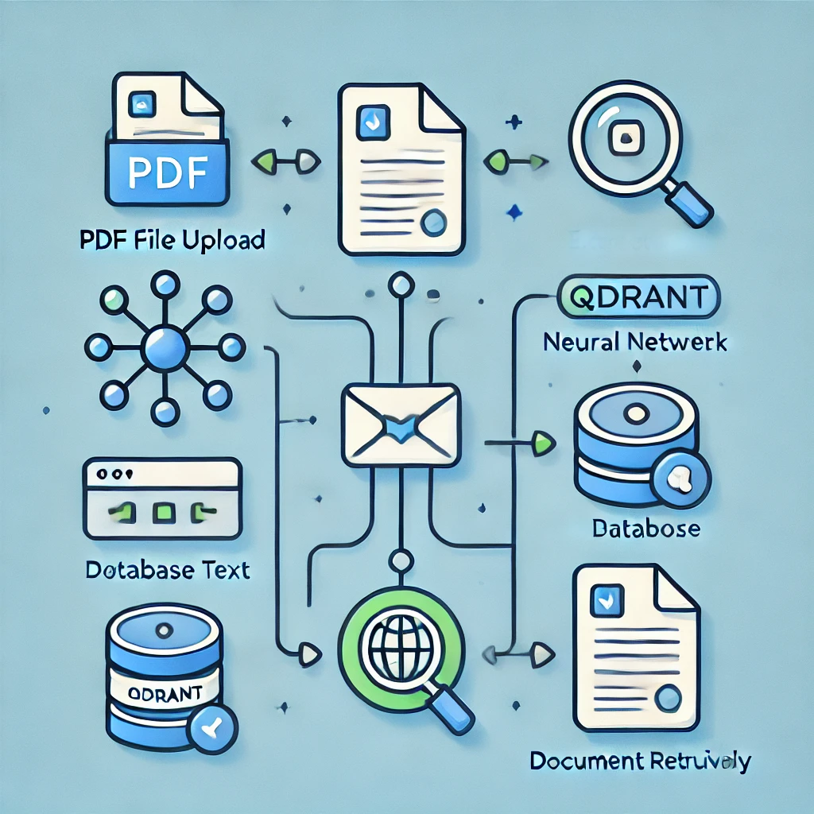
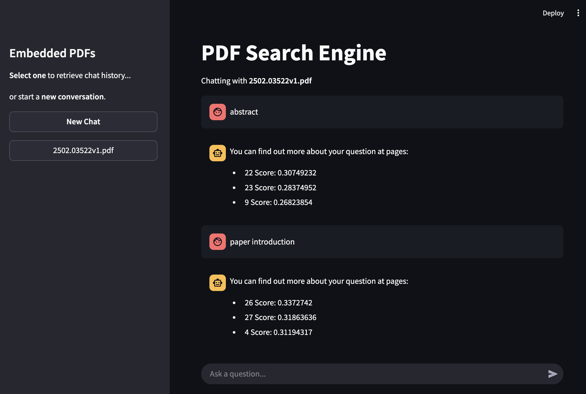

# PDF Embed Search 🔍📄

<div style="display: flex; align-items: center;">
  
  <p>A lightweight application that extracts, indexes, and searches PDF content using embeddings and Qdrant, all within a Streamlit-powered chat interface.</p>
</div>

## Features 🚀
- **PDF Parsing**: Extracts and processes text from multi-page PDFs.
- **Embedding Model**: Utilizes a small, efficient embedding model for text vectorization.
- **Qdrant Indexing**: Stores and retrieves document chunks with high-speed vector search.
- **Chat Interface**: A user-friendly Streamlit UI for natural language queries.



## Tech Stack 🛠
- **Python 3.13**
- **Qdrant** for fast vector search
- **Streamlit** for interactive chat UI
- **Small Embedding Model** (all-MiniLM-L6-v2)

## Usage 💡
### Run the App
#### PowerShell (Windows)
```powershell
streamlit run app.py
```

#### macOS/Linux
```sh
streamlit run app.py
```

### Inside the app
3. Upload a PDF
4. The app extracts and indexes text into Qdrant
5. Ask questions in the chat, and the app retrieves relevant chunks

## Install and Run Qdrant in Docker
To set up and run Qdrant using Docker, follow these steps:

### 1. Install Docker
Ensure you have Docker installed. If not, download and install it from [Docker's official website](https://www.docker.com/get-started).

### 2. Pull the Qdrant Docker Image
Run the following command to download the latest Qdrant image:

```sh
docker pull qdrant/qdrant
```

### 3. Run Qdrant Container
Execute the following command to start the Qdrant server:

```sh
docker run -p 6333:6333 -p 6334:6334 qdrant/qdrant
```

This will start the Qdrant server and expose ports **6333** (REST API) and **6334** (gRPC API).

### 4. Verify Qdrant is Running
Check if Qdrant is running by opening a browser or using `curl`:

```sh
curl http://localhost:6333/healthz
```

If the server is running correctly, you should receive a response like:

```json
{"status":"ok"}
```

### 5. Use Qdrant in the Application
Ensure your application is configured to connect to `http://localhost:6333` to interact with the Qdrant server.

Now, your vector search backend is ready to use!

